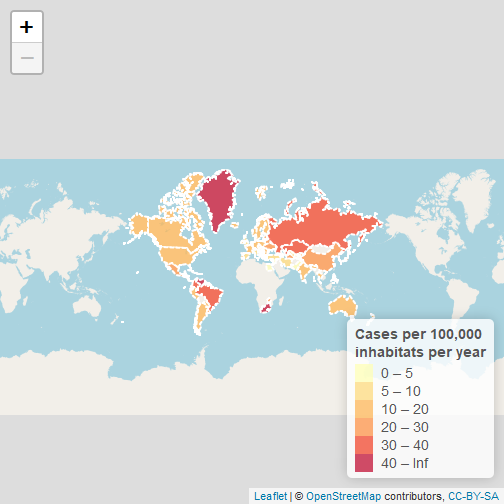

## About shiny app

Shiny app has 2 tabs: **About**, **Leaflet Updates**. 

* **About** is just simple description text.
* On **Leaflet Updates** you can find a interactive map with 2 single choice inputs. Map will be recolored depending on those. 
* Controls: 
  + First input: a choice between different death types 
  + Second input: a slider with number of colors. 
                             It controls the number of split groups to color countries.
* Hovering on colored county will show its name and deaths count of selected type.
* Inputs are reactive, but map is kinda slow. Please have a patience;)

--- .class #id 


## Data
Data used: yearly intentional deaths per capita according to a Wiki page: [link](https://en.wikipedia.org/wiki/List_of_countries_by_intentional_death_rate).


```r
#data are scraped from web
#here how it looks after some cleaning
head(idpcpy)
```

```
##    rank               country homicide suicide intentional death ratio
## 1:  108                 Egypt      3.4     0.1               3.5 34.00
## 2:  107              Maldives      3.9     0.3               4.2 13.00
## 3:  106                 Syria      2.3     0.1               2.4 23.00
## 4:  105 São Tomé and Príncipe      1.9     0.9               2.8  2.11
## 5:  104            Azerbaijan      2.1     0.6               2.8  3.50
## 6:  103                Jordan      2.0     1.1               2.9  1.82
```

--- .class #id


## Example

### Intetional deaths a year per 100 000 inhabits
Slidify seem to leave only image of a map. In app it is interactive.



--- .class #id

## Thank you
